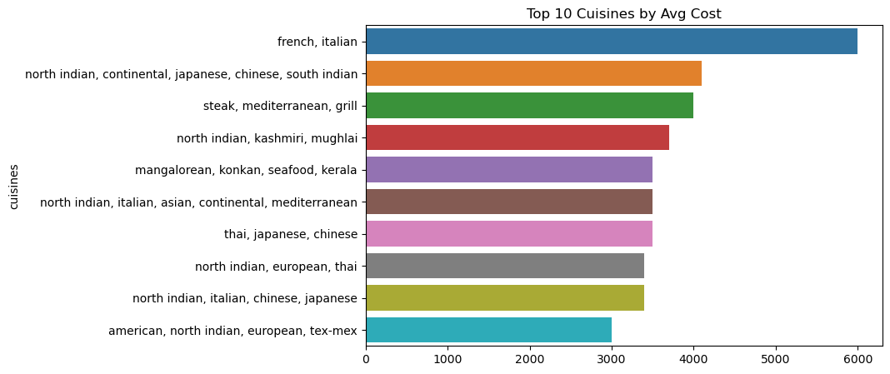

## Zomato Bangalore Restaurant Analysis

 
##  Tools Used:

Python
SQL
Power BI  

##  Skills Demonstrated :

Data Cleaning, Fature Engineering, Exploratory Data Analysis (EDA), SQL Querying, Data Visualization, Business Insights, DAX , Dashboarding in PowerBI 

---

##  Project Objective

The goal of this end-to-end data analysis project is to explore and extract valuable business insights from Zomato's Bangalore restaurant dataset. The project focuses on answering key questions such as:

- Which locations have the highest restaurant density?
- How does online ordering affect customer ratings?
- What cuisines are affordable yet highly rated?
- Which restaurant types attract the most votes?

This project simulates a real-world data analyst workflow — starting from raw data cleaning, followed by deep exploratory analysis using Python and SQL, and finishing with interactive dashboards using Power BI for stakeholder communication.

---

## Dataset Summary

-  **Source**: Kaggle (Zomato Bangalore Restaurants Dataset)  
-  **Size**: ~100,000+ rows (not hosted due to GitHub size restrictions. [📥 Dataset Link](https://www.kaggle.com/datasets/shrutimehta/zomato-restaurants-data))  
- **Features**:  
  - `name`, `location`, `rest_type`, `cuisines`, `rate`, `votes`, `approx_cost(for two people)`, `online_order`, etc.

---

## 🔧 Steps Followed

### 1.  Data Cleaning using Python (Pandas & Numpy)

- Handled missing values (e.g., unrated restaurants, null cuisines)
- Cleaned columns like `rate`, `approx_cost` using regex and typecasting
- Standardized text formats (e.g., restaurant types, cost formats)
- Removed duplicates and inconsistent entries

 _Notebook:_ `python_eda.ipynb`

---

### 2. 📊 Exploratory Data Analysis (Python)

Uncovered data patterns and trends using matplotlib/seaborn:

#### Cost Analysis
- Most restaurants fall under the **₹200–₹500** cost range.
- **Higher cost buckets** don't always receive better ratings.

 

####  Online Ordering Impact
- Restaurants offering **online delivery** have slightly **higher average ratings**.

 

####  Location Insights
- **BTM, HSR Layout, and Koramangala 5th Block** have the highest restaurant density.
  
 

####  Cuisine Preferences
- **South Indian**, **North Indian**, and **Cafe-style cuisines** dominate the market.
- Some cuisines like **Cafe, Tea, Fast Food** are **both affordable and highly rated**.

  
 

#### Rating Behavior
- Restaurants with higher **votes** often show higher **ratings**, indicating social proof influence.

 

---

### 3.  SQL Queries for Business Insights

 _Notebook:_ `sql_queries.ipynb`  
Data was imported into SQLite and queried using pandas.

####  Sample Business Queries Answered:
- Top 5 restaurant types with highest average votes
- Most affordable yet highly rated restaurants
- Best locations by total restaurant count, average cost, and rating
- Cuisine types ranked by rating and cost

> **Insight**: *Microbreweries* and *Pubs* receive the highest customer engagement (votes).  
>  **Insight**: *Rajajinagar, Malleshwaram, Banashankari* have affordable yet top-rated restaurants.

---

### 4.  Power BI Dashboard

**Tool Used**: Microsoft Power BI Desktop  
Created a **2-page interactive dashboard** with DAX measures to summarize key insights:

#### Page 1: Overview Dashboard
- Restaurant count by type (doughnut chart)
- Average rating by online order
- Top 10 locations by restaurant count
- Cost buckets and rating distribution

#### Page 2: Cuisine & Cost Analytics
- Top cuisines by rating and cost
- Restaurant type distribution
- Rating vs Cost Scatter
- Restaurant count by location (Map)

📁 _Dashboard not uploaded due to file size (100MB+)._  
🔗 **[Power BI Dashboard – View PDF or Report Link](#)** *(Add your link here to PDF or hosted report)*

---

## 📈 Key Business Insights

-  **Online ordering** improves customer satisfaction.
- **Local cuisines** (South Indian, Cafe) outperform international cuisines in ratings.
-  **Affordable food** doesn’t mean lower quality — some of the highest-rated places are under ₹200.
- 📍 **BTM and Koramangala** are hotspots for restaurants and customer traffic.
-  **Microbreweries** get the most engagement via votes and ratings.

---

## 🧠 Skills Highlighted

| Skill              | Tool/Method         |
|-------------------|---------------------|
| Data Cleaning      | Python (Pandas)     |
| EDA & Visualization| Python (Matplotlib, Seaborn) |
| SQL Querying       | SQLite3             |
| Dashboarding       | Power BI + DAX
